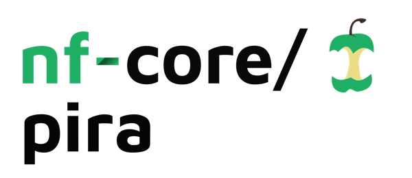
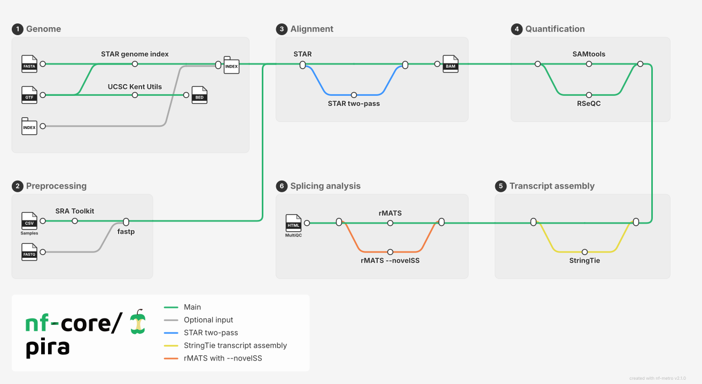

<h1>
  <picture>
    <source media="(prefers-color-scheme: dark)" srcset="docs/images/nf-core-pira_logo_dark.png">
    
  </picture>
</h1>

[](https://github.com/codespaces/new/nf-core/pira)
[](https://github.com/nf-core/pira/actions/workflows/nf-test.yml)
[](https://github.com/nf-core/pira/actions/workflows/linting.yml)[](https://nf-co.re/pira/results)[](https://doi.org/10.5281/zenodo.XXXXXXX)
[](https://www.nf-test.com)

[](https://www.nextflow.io/)
[](https://github.com/nf-core/tools/releases/tag/3.4.1)
[](https://docs.conda.io/en/latest/)
[](https://www.docker.com/)
[](https://sylabs.io/docs/)
[](https://cloud.seqera.io/launch?pipeline=https://github.com/nf-core/pira)

[](https://nfcore.slack.com/channels/pira)[](https://bsky.app/profile/nf-co.re)[](https://mstdn.science/@nf_core)[](https://www.youtube.com/c/nf-core)

## Introduction

**nf-core/pira** is a bioinformatics pipeline to identifying RNA alternatives.



1. Reference genome:
   1. Use or compute genome index with [STAR](https://physiology.med.cornell.edu/faculty/skrabanek/lab/angsd/lecture_notes/STARmanual.pdf);
   2. Compute `BED` file with [UCSC tools](https://genome.ucsc.edu/goldenPath/help/hgTablesHelp.html).
2. Samples:
   1. Use or download sample data from `SRA` with NCBI's [SRA Toolkit](https://github.com/ncbi/sra-tools/wiki/08.-prefetch-and-fasterq-dump).
3. Quality control and trimming with [FASTP](https://github.com/OpenGene/fastp);
4. Alignment and quantification with [STAR](https://physiology.med.cornell.edu/faculty/skrabanek/lab/angsd/lecture_notes/STARmanual.pdf);
5. Sort and index `BAM` files with [SAMtools](http://www.htslib.org/);
6. Alignment quality control with [RSeQC](http://rseqc.sourceforge.net/);
7. Transcript assembly and merge with [StringTie2](https://ccb.jhu.edu/software/stringtie/);
8. Alternative splicing analysis with [rMATS](http://rnaseq-mats.sourceforge.net/).

## Usage

> [!NOTE]
> If you are new to Nextflow and nf-core, please refer to [this page](https://nf-co.re/docs/usage/installation) on how
> to set-up Nextflow. Make sure to [test your setup](https://nf-co.re/docs/usage/introduction#how-to-run-a-pipeline)
> with `-profile test` before running the workflow on actual data.

<!-- TODO nf-core: Describe the minimum required steps to execute the pipeline, e.g. how to prepare samplesheets.
     Explain what rows and columns represent. For instance (please edit as appropriate):

First, prepare a samplesheet with your input data that looks as follows:

`samplesheet.csv`:

```csv
sample,fastq_1,fastq_2
run,experiment,condition,fastq_1,fastq_2
SRR16496056,SRX12699021,COND1,SRR16496056_1.fastq.gz,SRR16496056_2.fastq.gz
SRR16496066,SRX12699031,COND2,SRR16496066_1.fastq.gz,SRR16496066_2.fastq.gz
```

Each row represents a fastq file (single-end) or a pair of fastq files (paired end). For aligment, rows with 'runs' with
the same `experiment` value will be treated as replicates of the same experiment and merged. Similarly, for alternative
splicing analysis, rows with the same `condition` value will be treated as replicates of the same condition.

-->

Now, you can run the pipeline using:

<!-- TODO nf-core: update the following command to include all required parameters for a minimal example -->

```bash
nextflow run nf-core/pira \
   -profile <docker/singularity/.../institute> \
   --input "samplesheet.csv" \
   --outdir <OUTDIR> \
   --with_fastq \
   --fasta <FASTA> \
   --gtf <GTF> \
   --index <INDEX_DIR>
```

> [!WARNING]
> Please provide pipeline parameters via the CLI or Nextflow `-params-file` option. Custom config files including those provided by the `-c` Nextflow option can be used to provide any configuration _**except for parameters**_; see [docs](https://nf-co.re/docs/usage/getting_started/configuration#custom-configuration-files).

For more details and further functionality, please refer to the [usage documentation](https://nf-co.re/pira/usage) and the [parameter documentation](https://nf-co.re/pira/parameters).

## Pipeline output

To see the results of an example test run with a full size dataset refer to the [results](https://nf-co.re/pira/results)
tab on the nf-core website pipeline page. For more details about the output files and reports, please refer to the
[output documentation](https://nf-co.re/pira/output).

## Credits

These scripts were originally written by [Luíza Zuvanov](@luizazuvanov). The pipeline was re-written in Nextflow DSL2 by
[Andre Perez](@andre-marcos-perez) and is currently maintained by [Luíza Zuvanov](@luizazuvanov),
[Andre Perez](@andre-marcos-perez) and the nf-core community.

## Contributions and Support

If you would like to contribute to this pipeline, please see the [contributing guidelines](.github/CONTRIBUTING.md).

For further information or help, don't hesitate to get in touch on the
[Slack `#pira` channel](https://nfcore.slack.com/channels/pira) (you can join with [this invite](https://nf-co.re/join/slack)).

## Citations

<!-- TODO nf-core: Add citation for pipeline after first release. Uncomment lines below and update Zenodo doi and badge at the top of this file. -->
<!-- If you use nf-core/pira for your analysis, please cite it using the following doi: [10.5281/zenodo.XXXXXX](https://doi.org/10.5281/zenodo.XXXXXX) -->

<!-- TODO nf-core: Add bibliography of tools and data used in your pipeline -->

An extensive list of references for the tools used by the pipeline can be found in the [`CITATIONS.md`](CITATIONS.md) file.

You can cite the `nf-core` publication as follows:

> **The nf-core framework for community-curated bioinformatics pipelines.**
>
> Philip Ewels, Alexander Peltzer, Sven Fillinger, Harshil Patel, Johannes Alneberg, Andreas Wilm, Maxime Ulysse Garcia, Paolo Di Tommaso & Sven Nahnsen.
>
> _Nat Biotechnol._ 2020 Feb 13. doi: [10.1038/s41587-020-0439-x](https://dx.doi.org/10.1038/s41587-020-0439-x).
