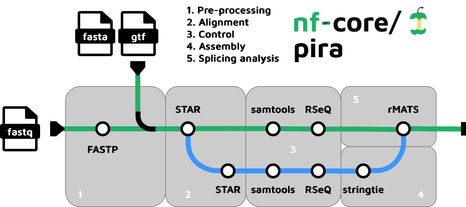

<h1>
  <picture>
    <source media="(prefers-color-scheme: dark)" srcset="docs/images/nf-core-pira_logo_dark.png">
    
  </picture>
</h1>

[](https://github.com/codespaces/new/nf-core/pira)
[](https://github.com/nf-core/pira/actions/workflows/nf-test.yml)
[](https://github.com/nf-core/pira/actions/workflows/linting.yml)[](https://nf-co.re/pira/results)[](https://doi.org/10.5281/zenodo.XXXXXXX)
[](https://www.nf-test.com)

[](https://www.nextflow.io/)
[](https://github.com/nf-core/tools/releases/tag/3.4.1)
[](https://docs.conda.io/en/latest/)
[](https://www.docker.com/)
[](https://sylabs.io/docs/)
[](https://cloud.seqera.io/launch?pipeline=https://github.com/nf-core/pira)

[](https://nfcore.slack.com/channels/pira)[](https://bsky.app/profile/nf-co.re)[](https://mstdn.science/@nf_core)[](https://www.youtube.com/c/nf-core)

## Introduction

**nf-core/pira** is a bioinformatics pipeline for **P**ipeline for **I**dentifying **R**NA **A**lternatives. It is designed to perform end-to-end event-based alternative splicing analysis from bulk RNA-seq data, starting from raw FASTQ files (or NCBI SRA accessions) through to differential splicing results.

The pipeline is particularly suited for studies comparing two biological conditions (e.g., treatment vs. control, two developmental time-points, two tissue types) where detecting changes in alternative splicing patterns — such as exon skipping, intron retention, or alternative splice-site usage — is the primary scientific goal.



1. **Reference genome preparation**
   1. Compute a `BED12` file from the GTF annotation with [UCSC gtfToGenePred / genePredToBed](https://genome.ucsc.edu/goldenPath/help/hgTablesHelp.html) — used for downstream RSeQC analyses.
   2. Build a STAR genome index from the supplied FASTA and GTF files with [STAR](https://github.com/alexdobin/STAR) (skipped if `--index` is provided).
2. **Sample retrieval** _(optional — skipped when `--with_fastq` is set)_
   - Download raw sequencing data from NCBI SRA using [SRA Toolkit](https://github.com/ncbi/sra-tools) (`prefetch` + `fasterq-dump`).
3. **Quality control and adapter trimming** with [fastp](https://github.com/OpenGene/fastp) — generates per-run QC reports (HTML + JSON).
4. **Spliced alignment** with [STAR](https://github.com/alexdobin/STAR)
   1. **Baseline pass** — aligns trimmed reads to the genome; splice junctions are filtered for the two-pass step.
   2. **Two-pass (de novo) alignment** _(default, controlled by `--with_twopass`)_ — re-aligns reads using the splice junctions discovered in the baseline pass, improving sensitivity at novel junctions.
5. **Alignment post-processing** with [SAMtools](http://www.htslib.org/) — coordinate-sorted BAM files are indexed and flagstat / stats reports are generated per experiment.
6. **Alignment quality control** with [RSeQC](http://rseqc.sourceforge.net/)
   - `infer_experiment.py` — infers library strand specificity, which is propagated to downstream tools.
   - `junction_annotation.py`, `junction_saturation.py`, `read_distribution.py` — assess junction completeness and read distribution across genomic features.
7. **Transcript assembly** _(optional — controlled by `--with_transcriptassembly`)_ with [StringTie2](https://ccb.jhu.edu/software/stringtie/)
   1. Per-experiment transcript assembly guided by the reference GTF.
   2. Merge of all per-experiment assemblies into a single consensus annotation for downstream analysis.
8. **Event-based alternative splicing analysis** with [rMATS-turbo](https://github.com/Xinglab/rmats-turbo) — detects and quantifies five classes of alternative splicing events (SE, A5SS, A3SS, MXE, RI) between every pair of conditions.

## Usage

> [!NOTE]
> If you are new to Nextflow and nf-core, please refer to [this page](https://nf-co.re/docs/usage/installation) on how
> to set-up Nextflow. Make sure to [test your setup](https://nf-co.re/docs/usage/introduction#how-to-run-a-pipeline)
> with `-profile test` before running the workflow on actual data.

First, prepare a samplesheet with your input data that looks as follows:

`samplesheet.csv`:

```csv
run,experiment,condition,single_end,fastq_1,fastq_2
SRR16496056,SRX12699021,COND1,false,SRR16496056_1.fastq.gz,SRR16496056_2.fastq.gz
SRR16496057,SRX12699022,COND1,false,SRR16496057_1.fastq.gz,SRR16496057_2.fastq.gz
SRR16496066,SRX12699031,COND2,false,SRR16496066_1.fastq.gz,SRR16496066_2.fastq.gz
SRR16496067,SRX12699032,COND2,false,SRR16496067_1.fastq.gz,SRR16496067_2.fastq.gz
```

Each row represents a sequencing run (single-end or paired-end). Runs sharing the same `experiment` value are treated as
technical replicates and merged before alignment. Runs sharing the same `condition` value are grouped as biological
replicates for the alternative splicing analysis.

When starting from NCBI SRA accessions (omit `--with_fastq`), the `fastq_1` / `fastq_2` columns can be left empty —
the pipeline will download the data automatically using the `run` accession ID.

Now, you can run the pipeline using:

```bash
nextflow run nf-core/pira \
   -profile <docker/singularity/.../institute> \
   --input samplesheet.csv \
   --outdir <OUTDIR> \
   --with_fastq \
   --fasta <GENOME.fa> \
   --gtf <ANNOTATION.gtf>
```

> [!WARNING]
> Please provide pipeline parameters via the CLI or Nextflow `-params-file` option. Custom config files including those provided by the `-c` Nextflow option can be used to provide any configuration _**except for parameters**_; see [docs](https://nf-co.re/docs/usage/getting_started/configuration#custom-configuration-files).

For more details and further functionality, please refer to the [usage documentation](https://nf-co.re/pira/usage) and the [parameter documentation](https://nf-co.re/pira/parameters).

## Pipeline output

To see the results of an example test run with a full size dataset refer to the [results](https://nf-co.re/pira/results)
tab on the nf-core website pipeline page. For more details about the output files and reports, please refer to the
[output documentation](https://nf-co.re/pira/output).

## Credits

nf-core/pira was originally written by [Luíza Zuvanov](https://github.com/luizazuvanov). The pipeline was re-written in Nextflow DSL2 by
[Andre Perez](https://github.com/andre-marcos-perez) and is currently maintained by [Luíza Zuvanov](https://github.com/luizazuvanov),
[Andre Perez](https://github.com/andre-marcos-perez) and the nf-core community.

## Contributions and Support

If you would like to contribute to this pipeline, please see the [contributing guidelines](.github/CONTRIBUTING.md).

For further information or help, don't hesitate to get in touch on the
[Slack `#pira` channel](https://nfcore.slack.com/channels/pira) (you can join with [this invite](https://nf-co.re/join/slack)).

## Citations

<!-- If you use nf-core/pira for your analysis, please cite it using the following doi: [10.5281/zenodo.XXXXXX](https://doi.org/10.5281/zenodo.XXXXXX) -->

An extensive list of references for the tools used by the pipeline can be found in the [`CITATIONS.md`](CITATIONS.md) file.

You can cite the `nf-core` publication as follows:

> **The nf-core framework for community-curated bioinformatics pipelines.**
>
> Philip Ewels, Alexander Peltzer, Sven Fillinger, Harshil Patel, Johannes Alneberg, Andreas Wilm, Maxime Ulysse Garcia, Paolo Di Tommaso & Sven Nahnsen.
>
> _Nat Biotechnol._ 2020 Feb 13. doi: [10.1038/s41587-020-0439-x](https://dx.doi.org/10.1038/s41587-020-0439-x).
