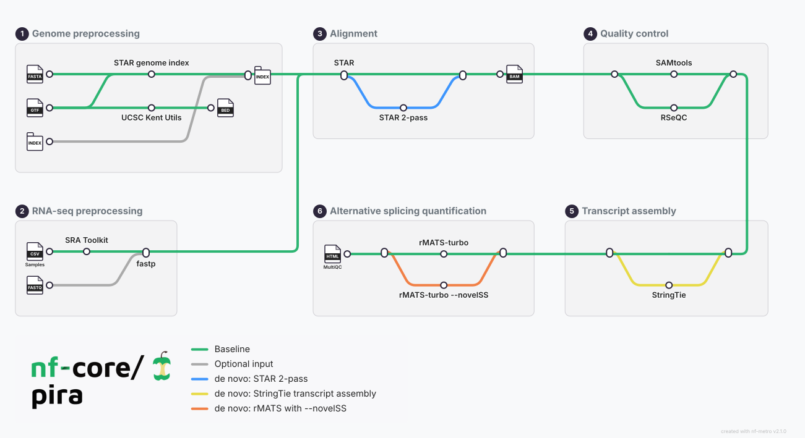

> Note: This repository is in the review stage by the nf-core community.

<h1>
  <picture>
    <source media="(prefers-color-scheme: dark)" srcset="docs/images/nf-core-pira_logo_dark.png">
    
  </picture>
</h1>

[](https://github.com/codespaces/new/nf-core/pira)
[](https://github.com/nf-core/pira/actions/workflows/nf-test.yml)
[](https://github.com/nf-core/pira/actions/workflows/linting.yml)[](https://nf-co.re/pira/results)[](https://doi.org/10.5281/zenodo.XXXXXXX)
[](https://www.nf-test.com)

[](https://www.nextflow.io/)
[](https://github.com/nf-core/tools/releases/tag/4.1.0)
[](https://docs.conda.io/en/latest/)
[](https://www.docker.com/)
[](https://sylabs.io/docs/)
[](https://cloud.seqera.io/launch?pipeline=https://github.com/nf-core/pira)

[](https://nfcore.slack.com/channels/pira)[](https://bsky.app/profile/nf-co.re)[](https://mstdn.science/@nf_core)[](https://www.youtube.com/c/nf-core)

## Introduction

**nf-core/pira** is a bioinformatics pipeline for identifying alternative RNA splicing events from RNA-seq data.



By default, the pipeline follows these stages:

- **Genome preprocessing**
  - Generates a STAR genome index from the reference FASTA and GTF files with [STAR](https://github.com/alexdobin/STAR), unless an existing index is supplied;
  - Generates a BED annotation with [UCSC Kent utilities](https://genome.ucsc.edu/goldenPath/help/hgTablesHelp.html).
- **RNA-seq preprocessing**
  - Downloads sample data from SRA with the [SRA Toolkit](https://github.com/ncbi/sra-tools/wiki/08.-prefetch-and-fasterq-dump), unless `--with_fastq` is used;
  - Performs FASTQ quality control and trimming with [fastp](https://github.com/OpenGene/fastp).
- **Alignment**
  - Aligns reads to the reference genome with [STAR](https://github.com/alexdobin/STAR);
  - Optionally performs a two-pass STAR alignment with `--with_twopass`.
- **Quality control**
  - Calculates BAM statistics and indexes with [SAMtools](https://www.htslib.org/);
  - Infers library strandedness with [RSeQC](http://rseqc.sourceforge.net/).
- **Transcript assembly**
  - Optionally assembles transcripts and estimates gene abundance with [StringTie](https://ccb.jhu.edu/software/stringtie/), enabled with `--with_transcriptassembly`.
- **Alternative splicing quantification**
  - Identifies alternative splicing events with [rMATS-turbo](https://github.com/Xinglab/rmats-turbo);
  - Optionally enables novel splice-site detection with `--with_novelss`;
  - Aggregates quality-control reports with MultiQC.

## Usage

> [!NOTE]
> If you are new to Nextflow and nf-core, please refer to [this page](https://nf-co.re/docs/get_started/environment_setup/overview) on how to set-up Nextflow. Make sure to [test your setup](https://nf-co.re/docs/get_started/run-your-first-pipeline) with `-profile test` before running the workflow on actual data.

First, prepare a samplesheet with a header row. The required columns are `run`, `experiment`, `condition`, and `single_end`. When `--with_fastq` is enabled, add `fastq_1` and `fastq_2` for paired-end samples.

`samplesheet.csv`:

```csv
run,experiment,condition,single_end
SRR16496056,SRX12699021,control,false
```

Each row represents one sequencing run. Use the same `condition` value for biological replicates that should be compared. For single-end data, set `single_end` to `true` and leave `fastq_2` empty. Now, you can run the pipeline using:

```bash
nextflow run nf-core/pira \
   -profile <docker/singularity/.../institute> \
   --input samplesheet.csv \
   --fasta reference.fa \
   --gtf annotation.gtf \
   --outdir <OUTDIR>
```

> [!WARNING]
> Please provide pipeline parameters via the CLI or Nextflow `-params-file` option. Custom config files including those provided by the `-c` Nextflow option can be used to provide any configuration _**except for parameters**_; see [docs](https://nf-co.re/docs/running/run-pipelines#using-parameter-files).

With the default parameters, samples are downloaded from SRA. To use the FASTQ paths in the samplesheet instead, add `--with_fastq`. Create a samplesheet containing the FASTQ paths:

```csv
run,experiment,condition,single_end,fastq_1,fastq_2
sample-1,experiment-1,control,false,reads/sample-1_R1.fastq.gz,reads/sample-1_R2.fastq.gz
```

Save it as `samplesheet_fastq.csv` and run:

```bash
nextflow run nf-core/pira \
   -profile docker \
  --input samplesheet_fastq.csv \
   --with_fastq \
   --fasta reference.fa \
   --gtf annotation.gtf \
   --outdir results
```

Optional analysis stages can be enabled with `--with_twopass`, `--with_transcriptassembly`, and `--with_novelss`. An existing STAR index can be supplied with `--index`; otherwise it is generated from the FASTA and GTF files.

For more details, see the [usage documentation](docs/usage.md), [output documentation](docs/output.md), and [parameter documentation](https://nf-co.re/pira/parameters).

## Pipeline output

The pipeline publishes results under the output directory, including:

- `multiqc/multiqc_report.html`: aggregated quality-control report;
- `fastp/`: FASTP reports and trimmed reads;
- `star/`: STAR alignment results and logs;
- `samtools/`: alignment statistics and BAM indexes;
- `rseqc/`: strandedness inference reports;
- `stringtie/`: optional transcript assemblies and abundance tables;
- `rmats/`: alternative splicing event tables and summaries;
- `pipeline_info/`: execution reports, parameters, software versions, and workflow summaries.

See the [output documentation](docs/output.md) for the complete output layout. Example full-size runs are available on the [nf-core results page](https://nf-co.re/pira/results).

## Credits

The original pipeline was implemented using shell scripts and was initially written by [Luíza Zuvanov](https://github.com/luizazuvanov). It was re-written in Nextflow DSL2 by [André Perez](https://github.com/andre-marcos-perez) and is maintained by Luíza Zuvanov, André Perez, and the nf-core community.

## Contributions and Support

If you would like to contribute to this pipeline, please see the [contributing guidelines](docs/CONTRIBUTING.md).

For further information or help, don't hesitate to get in touch on the [Slack `#pira` channel](https://nfcore.slack.com/channels/pira) (you can join with [this invite](https://nf-co.re/join/slack)).

## Citations

The pipeline is under development. Once a release DOI is available, cite the corresponding nf-core/pira release record.

An extensive list of references for the tools used by the pipeline can be found in the [`CITATIONS.md`](CITATIONS.md) file.

You can cite the `nf-core` publication as follows:

> **The nf-core framework for community-curated bioinformatics pipelines.**
>
> Philip Ewels, Alexander Peltzer, Sven Fillinger, Harshil Patel, Johannes Alneberg, Andreas Wilm, Maxime Ulysse Garcia, Paolo Di Tommaso & Sven Nahnsen.
>
> _Nat Biotechnol._ 2020 Feb 13. doi: [10.1038/s41587-020-0439-x](https://dx.doi.org/10.1038/s41587-020-0439-x).
