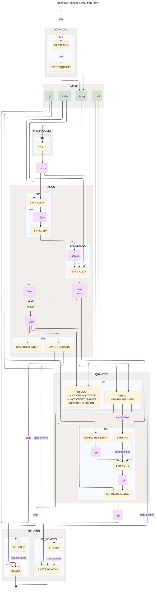

```mermaid
---
title: Nextflow Pipeline Execution Flow
config:
  theme: base
  layout: elk
---

flowchart TD

    A@{ shape: start }
    B@{ shape: start }
    C@{ shape: stop }

    F1@{ shape: win-pane, label: "fastq" }
    F2@{ shape: win-pane, label: "gtf" }
    F3@{ shape: win-pane, label: "index" }
    F4@{ shape: win-pane, label: "bed" }
    F5@{ shape: win-pane, label: "fastp" }
    F6@{ shape: win-pane, label: "spl jun" }
    F7@{ shape: win-pane, label: "spl jun" }
    F8@{ shape: win-pane, label: "bam" }
    F9@{ shape: win-pane, label: "bam \ndenovo" }
    F10@{ shape: win-pane, label: "bam" }
    F12@{ shape: win-pane, label: "gtf" }
    F13@{ shape: win-pane, label: "gtf" }
    F14@{ shape: win-pane, label: "gtf" }

    M1@{ shape: circle, label: "group" }

    ID1A(PREFETCH)
    ID1B(FASTERQDUMP)
    ID2A(FASTP)
    ID3A(STAR ALIGN)
    ID3B(SJ FILTER*)
    ID3C(STAR ALIGN)
    ID4A(SAMTOOLS STATS)
    ID4B(SAMTOOLS INDEX)
    ID5A(RSEQC INFEREXPERIMENT)
    ID5B@{ shape: procs, label: "RSEQC \n JUNCTIONANNOTATION \n JUNCTIONSATURATION \n READDISTRIBUTION"}
    ID6A(STRAND*)
    ID6B(STRINGTIE CLEAN*)
    ID6C(STRINGTIE)
    ID6D(STRINGTIE MERGE)
    ID7A(STRAND*)
    ID7B(RMATS DENOVO)
    ID7C(STRAND*)
    ID7D(RMATS)

    subgraph INPUT
        F1
        F2
        F3
        F4
    end

    subgraph DOWNLOAD
        subgraph ID1
            ID1A --> |sra| ID1B
        end
    end

    subgraph PRE-PROCESS
        subgraph ID2
            ID2A
        end
    end

    subgraph ALIGN
        subgraph ID3
            ID3A --> F6 --> ID3B
        end
        subgraph ID3_DENOVO
            ID3B --> F7 --> ID3C
        end
        subgraph ID4
            ID4A
            ID4B
        end
        ID3A --> F8 --> M1
        ID3C --> F9 --> M1
        M1 --> F10
    end

    subgraph QUANTIFY
        subgraph ID5
            ID5A
            ID5B
        end
        subgraph ID6
            ID6A --> |strandedness| ID6C
            ID6B --> F12 --> ID6C
            ID6C --> F13 --> ID6D
        end
    end

    subgraph SPLICING
        subgraph ID7_DENOVO
            ID7A --> |strandedness| ID7B
        end
        subgraph ID7
            ID7C --> |strandedness| ID7D
        end
    end

    B  --> F1
    A  -->|run| ID1A
    F1 --> ID2A
    F2 --> ID6B
    F2 --> ID6D
    F2 --> ID7D
    F3 --> ID3A
    F3 --> ID3C
    F4 --> ID5A
    F4 --> ID5B
    ID1B --> F1
    ID2A --> F5
    F5 --> ID3A
    F5 --> ID3C
    F10 --> ID4A
    F10 --> ID4B
    F10 --> ID5A
    F10 --> ID5B
    F9 --> ID6C
    ID5A --> |infer denovo| ID6A
    ID5A --> |infer| ID7C
    ID5A --> |infer denovo| ID7A
    ID6D --> F14 --> ID7B
    ID7B --> C
    ID7D --> C
    ID4A --> |stats denovo| ID7B
    ID4A --> |stats| ID7D

    style F1 fill:#D2E0D3
    style F2 fill:#D2E0D3
    style F3 fill:#D2E0D3
    style F4 fill:#D2E0D3

    style F5  fill:#F4DDFF
    style F6  fill:#F4DDFF
    style F7  fill:#F4DDFF
    style F8  fill:#F4DDFF
    style F9  fill:#F4DDFF
    style F10 fill:#F4DDFF
    style F12 fill:#F4DDFF
    style F13 fill:#F4DDFF
    style F14 fill:#F4DDFF

    style INPUT       fill:#F0EEEA
    style DOWNLOAD    fill:#F0EEEA
    style PRE-PROCESS fill:#F0EEEA
    style ALIGN       fill:#F0EEEA
    style QUANTIFY    fill:#F0EEEA
    style SPLICING    fill:#F0EEEA
```
